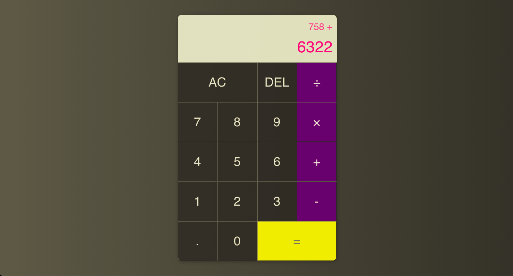

## REACT - CALCULATOR

Building a calculator using React and syled components !!!

---

---

### Live Demo

👉  [Deploy](https://calculator-e6599.web.app/ "Deploy")  👈

---

Let's connect 👨‍💻 and forge the future together 😁✌

 

 

